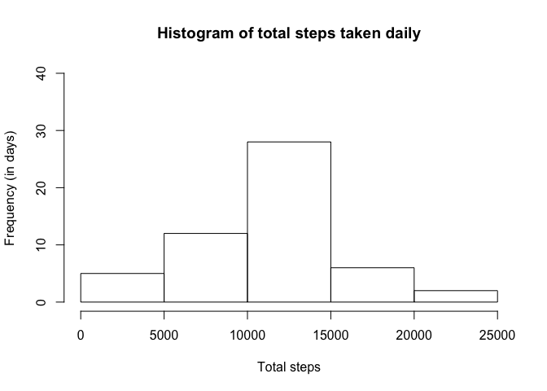
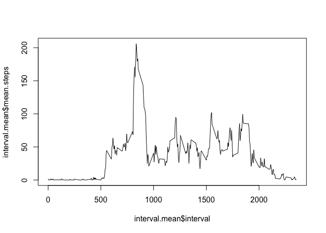
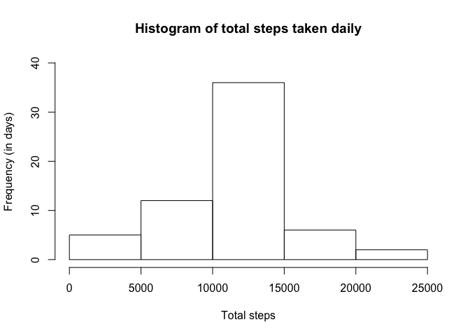
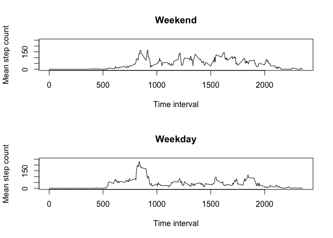

# Reproducible Research: Peer Assessment 1
We are provided with access to personal fitness data, specifically, a data set with the number of steps taken in each five minute interval of a sixty-one day period. Our data has three variables, date, interval, and steps. Interval gives the interval of the day, i.e., it resets to 0 each day. The data contain NA values.

The data are made available to us via a downloadable .zip file.

## Loading and preprocessing the data

We want to download the zipped data file, unzip it to access the comma separated value file, and import that file into R as a data frame. For convenience and system tidiness, we delete the the .zip and .csv files.

We convert the date variable from factor to Date class. We also wrap the data frame into a data frame tbl object. Finally, we make a copy of the data frame with NA values removed.


```r
library( dplyr)
```

```
## 
## Attaching package: 'dplyr'
## 
## The following objects are masked from 'package:stats':
## 
##     filter, lag
## 
## The following objects are masked from 'package:base':
## 
##     intersect, setdiff, setequal, union
```

```r
fileUrl = "https://d396qusza40orc.cloudfront.net/repdata%2Fdata%2Factivity.zip"
	# URL from project page; using URL from GitHub results in:
	# "Warning message:
	# In unzip(filePath, exdir = "./") : error 1 in extracting from zip file"
	
filePath = "./data.zip"

download.file( fileUrl, filePath, method = "curl")
	# download .zip file to working directory as data.zip

unzip( filePath,  exdir = "./")
	# unzip data.zip file

dataset = read.csv( "./activity.csv")
	# import data into data frame

unlink( c( filePath, "./activity.csv"))
	# delete data.zip, activity.csv from working directory

dataset$date = as.Date( dataset$date)

datatbl.full = tbl_df( dataset)
	# convert dataset to data tbl object

datatbl = datatbl.full[ complete.cases( datatbl.full),]
	# remove incomplete cases from data
```


## What is mean total number of steps taken per day?

Here we take advantage of the tbl object format, which allows us to quickly and easily group our data by date, much like we might do with an SQL SELECT statement.


```r
daily = group_by( datatbl, date)
	# group data by date
```

Next, we calculate and display the total number of steps taken per day. We also rename the column with total steps to a descriptive name with a nicer format. Note that when displaying a tbl object, only the first 10 rows are displayed.


```r
daily.steps.total = summarize( daily, sum( steps))
	# create data table with date column (unique rows) and total steps column

daily.steps.total = select( daily.steps.total, date, total.steps = starts_with( "sum"))
	# renaming second column; could not get rename function to work as expected,
	#	possibly due to the column name being in format of function call.

daily.steps.total
```

```
## Source: local data frame [53 x 2]
## 
##          date total.steps
##        (date)       (int)
## 1  2012-10-02         126
## 2  2012-10-03       11352
## 3  2012-10-04       12116
## 4  2012-10-05       13294
## 5  2012-10-06       15420
## 6  2012-10-07       11015
## 7  2012-10-09       12811
## 8  2012-10-10        9900
## 9  2012-10-11       10304
## 10 2012-10-12       17382
## ..        ...         ...
```

We want a histogram of the number of steps taken daily. Note that we scaled the Y axis so that the scale matches that of a similar histogram we do later, for ease of comparison (and code recycling). We use the base graphics package, since it serves our purposes quite easily.


```r
hist( daily.steps.total$total.steps, main = "Histogram of total steps taken daily", xlab = "Total steps", ylab = "Frequency (in days)", ylim = range( 0:40))
```

 

We also calculate the median and mean number of steps taken daily.


```r
mean( daily.steps.total$total.steps)
```

```
## [1] 10766.19
```

```r
median( daily.steps.total$total.steps)
```

```
## [1] 10765
```

## What is the average daily activity pattern?

We are interested in the average number of steps taken in each five minute interval. We first group the data by interval, then calculate the mean of each interval. As with daily totals, we rename the mean column of our new data frame.


```r
by.interval = group_by( datatbl, interval)
	# group data by interval

interval.mean = summarize( by.interval, mean( steps))
	# create 2 column table, interval and mean steps

interval.mean = select( interval.mean, interval, mean.steps = starts_with( "m"))
	# provide better column names
```

Instead of displaying the mean number of steps taken during each interval of the day, we choose to create a time series plot to better visualize average activity patterns.


```r
plot( interval.mean$interval, interval.mean$mean.steps, type = "l")
```

 

We want to know in which interval of the day our subject is most active.


```r
arrange( interval.mean, desc( mean.steps))[ 1,]
```

```
## Source: local data frame [1 x 2]
## 
##   interval mean.steps
##      (int)      (dbl)
## 1      835   206.1698
```

## Imputing missing values

We know our data set has rows with missing values. We'd like to know how many.


```r
sum( ! complete.cases( datatbl.full)) # This method checks all columns for missing values and avoids double	counting if the same row has more than one column with missing values.
```

```
## [1] 2304
```

We further determine that each day either has complete data or the data is completely missing. In other words, the total number of NA values for each day is either 0 or 288. The importance of this fact will soon become clear.


```r
as.data.frame( summarize( group_by( datatbl.full, date), sum( is.na( steps))))
```

```
##          date sum(is.na(steps))
## 1  2012-10-01               288
## 2  2012-10-02                 0
## 3  2012-10-03                 0
## 4  2012-10-04                 0
## 5  2012-10-05                 0
## 6  2012-10-06                 0
## 7  2012-10-07                 0
## 8  2012-10-08               288
## 9  2012-10-09                 0
## 10 2012-10-10                 0
## 11 2012-10-11                 0
## 12 2012-10-12                 0
## 13 2012-10-13                 0
## 14 2012-10-14                 0
## 15 2012-10-15                 0
## 16 2012-10-16                 0
## 17 2012-10-17                 0
## 18 2012-10-18                 0
## 19 2012-10-19                 0
## 20 2012-10-20                 0
## 21 2012-10-21                 0
## 22 2012-10-22                 0
## 23 2012-10-23                 0
## 24 2012-10-24                 0
## 25 2012-10-25                 0
## 26 2012-10-26                 0
## 27 2012-10-27                 0
## 28 2012-10-28                 0
## 29 2012-10-29                 0
## 30 2012-10-30                 0
## 31 2012-10-31                 0
## 32 2012-11-01               288
## 33 2012-11-02                 0
## 34 2012-11-03                 0
## 35 2012-11-04               288
## 36 2012-11-05                 0
## 37 2012-11-06                 0
## 38 2012-11-07                 0
## 39 2012-11-08                 0
## 40 2012-11-09               288
## 41 2012-11-10               288
## 42 2012-11-11                 0
## 43 2012-11-12                 0
## 44 2012-11-13                 0
## 45 2012-11-14               288
## 46 2012-11-15                 0
## 47 2012-11-16                 0
## 48 2012-11-17                 0
## 49 2012-11-18                 0
## 50 2012-11-19                 0
## 51 2012-11-20                 0
## 52 2012-11-21                 0
## 53 2012-11-22                 0
## 54 2012-11-23                 0
## 55 2012-11-24                 0
## 56 2012-11-25                 0
## 57 2012-11-26                 0
## 58 2012-11-27                 0
## 59 2012-11-28                 0
## 60 2012-11-29                 0
## 61 2012-11-30               288
```

We replace the missing values with the mean number of steps taken during that particular interval. Note that this converts the steps variable from integer to numeric class. We choose a for loop for this task, though other options exist. The variable *datatbl.full* contains our dataset with NA values included, so it is *datatbl.full* that we modify.


```r
for (i in 1 : length( datatbl.full$steps)) {

	if ( is.na( datatbl.full$steps[ i])) {
	
		x = datatbl.full$interval[ i] # obtain interval number
		
		datatbl.full$steps[ i] = filter( interval.mean, interval == x)$mean.steps # replace NA with interval's mean value
		
	}	

}
	# here we've created a for loop that replaces NA values for the steps variable with the mean interval value.
```

We're finished with the data set with the missing values removed. In order to easily recycle our code, we overwrite the contents of *datatbl* with *datatable.full*. The variable *datatbl* now has observations for all 61 days, with mean values replacing NA values.


```r
datatbl = datatbl.full
```

Now we can reuse previous code as written.


```r
daily = group_by( datatbl, date)
	# group data by date

# Calculate the total number of steps taken per day

daily.steps.total = summarize( daily, sum( steps))
	# create data table with date column (unique rows) and total steps column

daily.steps.total = select( daily.steps.total, date, total.steps = starts_with( "sum"))
	# renaming second column; could not get rename function to work as expected.

daily.steps.total
```

```
## Source: local data frame [61 x 2]
## 
##          date total.steps
##        (date)       (dbl)
## 1  2012-10-01    10766.19
## 2  2012-10-02      126.00
## 3  2012-10-03    11352.00
## 4  2012-10-04    12116.00
## 5  2012-10-05    13294.00
## 6  2012-10-06    15420.00
## 7  2012-10-07    11015.00
## 8  2012-10-08    10766.19
## 9  2012-10-09    12811.00
## 10 2012-10-10     9900.00
## ..        ...         ...
```

Now we plot a histogram with the missing values replaced. We use the same scale as our previous histogram o make comparison easier.


```r
hist( daily.steps.total$total.steps, main = "Histogram of total steps taken daily", xlab = "Total steps", ylab = "Frequency (in days)", ylim = range( 0:40))
```

 

We see that only our center bin increases in size compared to when we ignored the missing values.

We calculate the mean and median of our modified data set.


```r
mean( daily.steps.total$total.steps)
```

```
## [1] 10766.19
```

```r
median( daily.steps.total$total.steps)
```

```
## [1] 10766.19
```

We see that the mean remains unchanged. This makes sense, since only complete days contained missing values, and we've replaced those missing values with the mean values for their respective intervals (and thus have effectively only added days in which the mean number of steps were taken).

Similarly, our median has changed only very slightly, to the mean. Our original histogram indicates that our data are approximately symmetrical, so the median was approximately equal to the mean. By replacing the missing values with means, and because only complete days were missing, the new values appear in the center of the distribution. One of the new daily totals is exactly the center observation of our distribution, which changes the median value from approximately equal to the mean to exactly equal to the mean.

## Are there differences in activity patterns between weekdays and weekends?

We need to identify which observations were made on weekdays and which were made on weekends. Since we converted our date variable from factor to Date class, we can easily determine the day of the week, which allows us to create a new binary factor variable by which we can split our data.


```r
datatbl$day = ifelse( weekdays( datatbl$date) %in% c( "Saturday", "Sunday"), "Weekend", "Weekday")
	# Checks to see if date falls on a Saturday or Sunday and assigns binary
	#	factor value of weekend or weekday appropriately.

datatbl$day = factor( datatbl$day)
	# convert new variable to factor.

weekend = filter( datatbl, day == "Weekend")

weekday = filter( datatbl, day == "Weekday")
	# create seperate data frames for weekends and weekdays
```

Now we can group each of our two new data sets by interval and calculate the mean number of steps for each interval. Once again, we rename our new column variable.


```r
by.interval.we = group_by( weekend, interval)

by.interval.wd = group_by( weekday, interval)

interval.mean.we = summarize( by.interval.we, mean( steps))

interval.mean.wd = summarize( by.interval.wd, mean( steps))
	# create 2 column table, interval and mean steps


interval.mean.we = select( interval.mean.we, interval, mean.steps = starts_with( "m"))
	
interval.mean.wd = select( interval.mean.wd, interval, mean.steps = starts_with( "m"))
	# provide better column names
```

For easy comparison, we tell R to create two time series plots on the same panel, one for weekdays and one for weekends.


```r
par( mfrow = c( 2, 1))
	# prepare for two plots

plot( interval.mean.we$interval, interval.mean.we$mean.steps, type = "l", main = "Weekend", ylab = "Mean step count", xlab = "Time interval", ylim = range( 0:250))

plot( interval.mean.wd$interval, interval.mean.wd$mean.steps, type = "l", main = "Weekday", ylab = "Mean step count", xlab = "Time interval", ylim = range( 0:250))
```

 

```r
	# line plot with x = interval and y = mean number of steps
```

We see that peak activity occurs during late mornings throughout the entire week, but the weekday peak is greater than the weekend peak. Otherwise, more activity appears to occur on the weekends.

